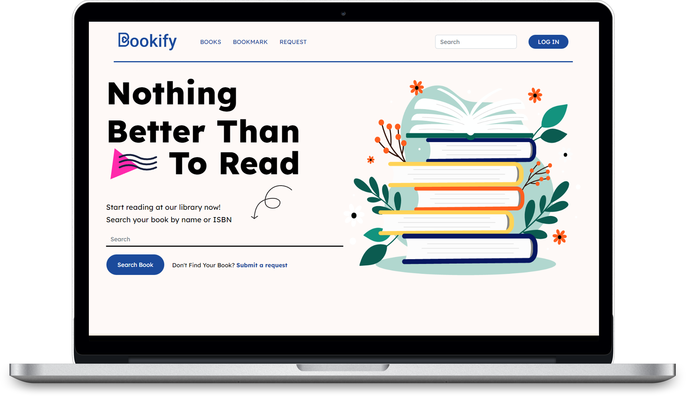

# Bookify
## A Project for a university course in 2022. The project is an online library that allow users to read and request to add books, and the admin to accept and add books. Implemented the front-end pages using bootstrap and CSS, and the backend using Node.js
### *Front-end by: Fadel Hassan, Backend by: Mohammed Abushwarib*
##
## Figma design: https://www.figma.com/community/file/1239604120253638049
##
### 1. The homepage

### 2. Sign Up

### 3. Log in

### 4. Search for a book

### 5. View the book information

### 6. Bookmark page

### 7. Admin page for accepting a request

